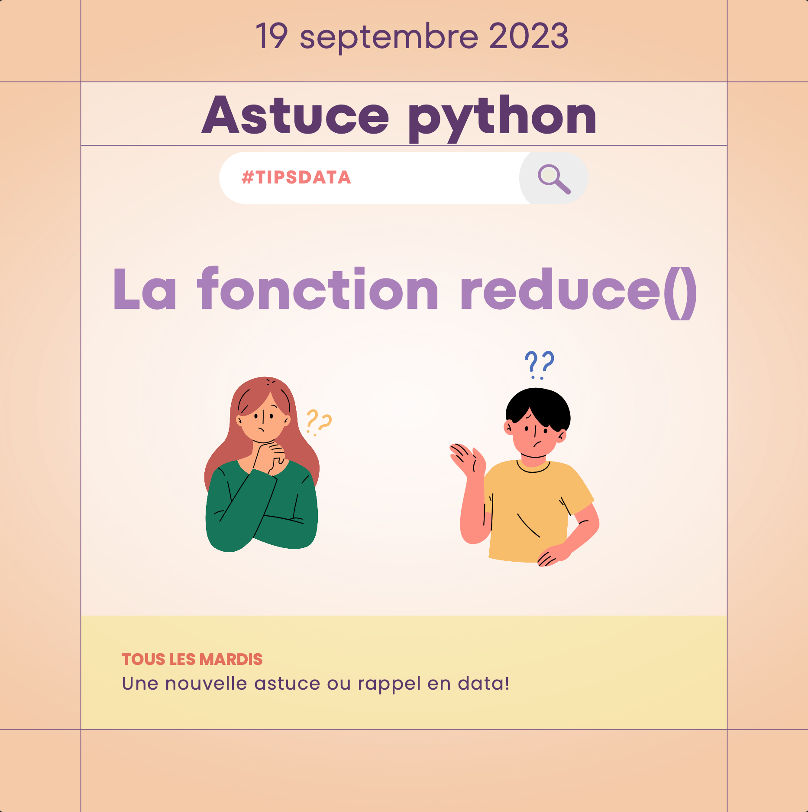

[Lien vers le post LinkedIn](https://www.linkedin.com/posts/bertrandfabre_la-fonction-reduce-en-python-activity-7109755489382531072-Qhae?utm_source=share&utm_medium=member_desktop)  

🤠 Mardi #tipsdata

❓C’est quoi la fonction reduce() en #python ?

💡 reduce() permet d’agréger des données d’un séquence comme une liste, mais pas seulement.
Le type d’agrégation doit être définit dans une fonction à part. Cela permet une personnalisation de l’agrégation.

⚠️ reduce() peut être moins lisible qu'une bonne vieille list comprehension et n’est pas obligatoirement plus performant. C’est surtout une autre manière de faire des agrégations.

👇 Un peu de code peut aider à comprendre les principes.  
[La fonction reduce() avec python.pdf](La%20fonction%20reduce%28%29%20avec%20python.pdf)

📘 [Documentation officielle](https://docs.python.org/3/library/functools.html#functools.reduce)  

❓Vous connaissiez la fonction reduce() ? Vous l’avez déjà directement utilisée dans votre code ?

#DataEngineering